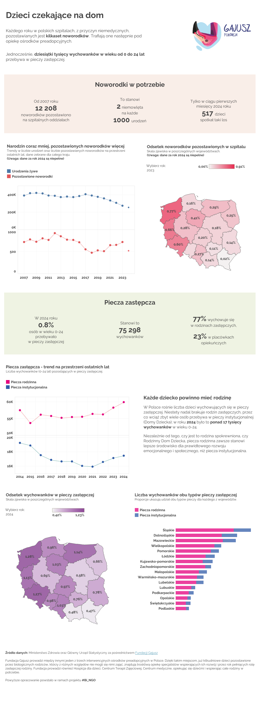

# Children Waiting for a Home

## About the Project

Every year, hundreds of newborns are left in Polish hospitals for reasons that have nothing to do with health. At the same time, tens of thousands of children and young people grow up in foster care, often without ever experiencing what it means to have a stable home.

This dashboard was created for [**Gajusz Foundation**](https://www.gajusz.org.pl/), a non-profit supporting children in crisis. The goal was to turn raw data about the scale of newborn abandonment and foster care into a clear, accessible visual story - something the foundation could use in volunteer trainings, awareness campaigns, and social media, helping people understand the scale of this quiet crisis.

Instead of technical deep dives, the focus was on clarity, simplicity, and helping the data speak for itself. 

The project received **special recognition** as one of the standout works in the **#Bi_NGO initiative**.

## Workflow

- **Data source**: Excel files with public data - provided by the foundation (folder `data/`)
- **Data preparation**: Power Query in Excel  
- **Exploratory Data Analysis**: MS Excel
- **Visualization**: Tableau Public  
- **Focus**: Simplicity, storytelling, and visual integrity  

## Recognition

- Selected as one of the top projects in the *Storytelling dla dociekliwego Kowalskiego* category
- Now actively used by the foundation in their real-world communications

## View the Dashboard

👉 [Click here to open the Tableau dashboard](https://public.tableau.com/app/profile/ilona.libront/viz/newdata_17343054191770/Dashboard)

### Personal Note

When I joined this initiative, I had just started learning Power BI and had never used Tableau before. But the topic touched me deeply, and I knew I wanted to take part, no matter what.

Initially, I did most of the work in Power BI. But just two days before the deadline, I realized that Tableau would be a better fit for sharing the dashboard publicly. I quickly learned the basics on the fly and rebuilt the entire dashboard from scratch. It was challenging, but the topic felt too important to give up on.
